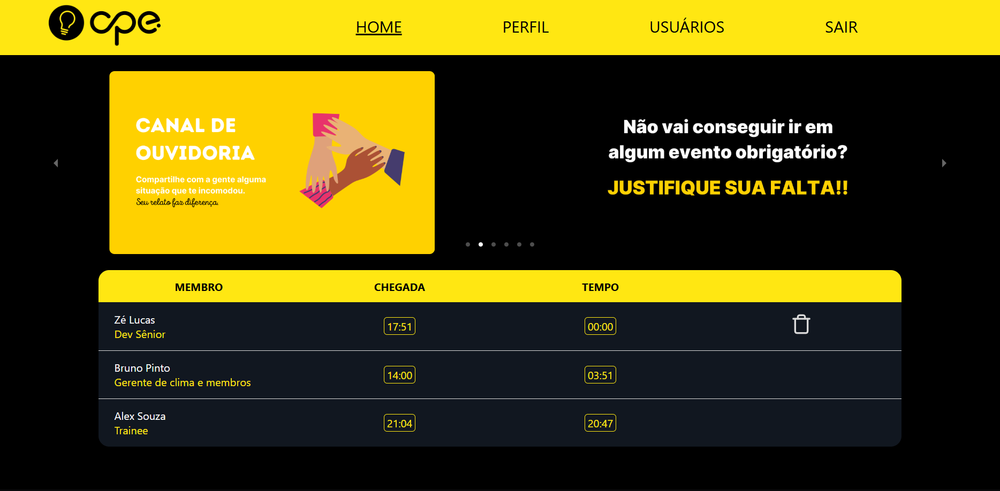

<p align="center">
  
</p>

<h1 align="center"><strong>Desafio Frontend 💻</strong></h1>

<p align="center">
  
  
  
  
  
  
</p>

<p align="center">
 <a href="#sobre">Sobre</a> • 
 <a href="#primeiros-passos">Primeiros Passos</a> • 
 <a href="#rotas">Rotas</a> •
 <a href="#backend">Backend</a>
</p>

<p align="center">
    <b>Frontend desenvolvido como parte de um desafio de trainee proposto pela <a href="https://github.com/cpejr" target="_blank">CPE Jr.</a></b>
</p>

---

<h2 id="sobre">📌 Sobre</h2>

Este projeto consiste em uma aplicação frontend que consome uma API de controle de ponto de usuários. Ele permite o cadastro, login e visualização das informações de sessões (pontos) e usuários.

<p align="center">
    
</p>

---

<h2 id="primeiros-passos">🚀 Primeiros Passos</h2>

### Pré-requisitos

Antes de começar, você vai precisar ter instalado:

- [Node.js](https://nodejs.org/)
- [Git](https://git-scm.com/)

### Clonando o repositório

```bash
git clone https://github.com/alexbeldam/frontend-ponto.git
```

### Instalando dependências

```bash
cd frontend-ponto
npm install
```

### Configurando variáveis de ambiente

Crie um arquivo `.env` na raiz do projeto com a seguinte variável:

```env
VITE_BACKEND_URL=http://localhost:8000
```

> Altere o valor conforme o endereço da sua API.

### 🔌 Conectando com o Backend

Certifique-se de que o backend esteja rodando localmente antes de iniciar o frontend.  
Você pode encontrar o repositório e as instruções de uso aqui:  
👉 **[https://github.com/alexbeldam/backend-ponto](https://github.com/alexbeldam/backend-ponto)**

### Iniciando o projeto

```bash
npm run dev
```

---

<h2 id="rotas">📍 Rotas da Aplicação</h2>

| Rota                  | Descrição                                                   |
|-----------------------|-------------------------------------------------------------|
| <kbd>/</kbd>     | Página principal com informações de sessões ativas       |
| <kbd>/login</kbd>         | Página de autenticação de usuário                         |
| <kbd>/cadastro</kbd>         | Página de cadastro de usuário                         |
| <kbd>/logout</kbd>  | Desloga o usuário       |
| <kbd>/perfil</kbd>  | Página que exibe informações do usuário autenticado        |
| <kbd>/usuarios</kbd>  | Página que exibe informações de todos os usuários        |

---

<h2 id="backend">🔌 Backend</h2>

Este frontend consome uma API que está disponível neste repositório:  
👉 **[https://github.com/alexbeldam/backend-ponto](https://github.com/alexbeldam/backend-ponto)**

---

<p align="center">
  Feito com 💛 durante o processo seletivo da <a href="https://github.com/cpejr" target="_blank">CPE Jr.</a>
</p>